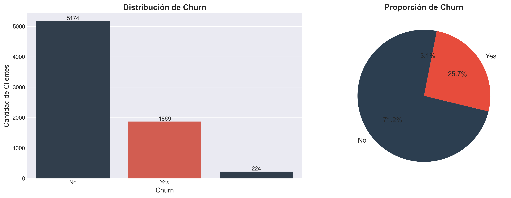
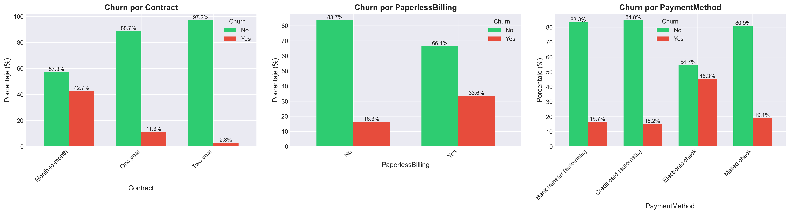
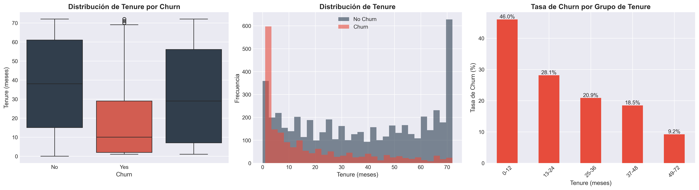
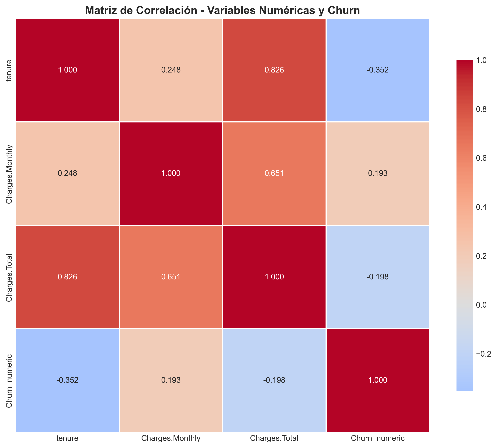

# Challenge TelecomX - ETL y Análisis Exploratorio de Datos

## Descripción del Proyecto

Este proyecto forma parte del Challenge de Data Science de Alura, consiste en realizar el proceso de extracción de datos, limpieza y transformación (ETL), para organizar los datos de manera que permitan análisis más profundos y visualizaciones. Enfocado en el análisis de datos de clientes de **TelecomX** para identificar patrones de **churn** (evasión de clientes) y proporcionar insights estratégicos para reducir la pérdida de clientes.

## Objetivo

Recopilar, procesar y analizar datos de clientes utilizando Python y sus principales bibliotecas para:

- ✅ Extraer información desde una API JSON
- ✅ Aplicar conceptos de ETL (Extracción, Transformación y Carga)
- ✅ Crear visualizaciones estratégicas
- ✅ Realizar Análisis Exploratorio de Datos (EDA)
- ✅ Generar insights y recomendaciones accionables

## Estructura del Proyecto

```
Challenge-TelecomX-Alura-One-DS/
│
├── /imgs                       # Imágenes del proyecto
├── TelecomX_ETL.ipynb          # Notebook principal con ETL y EDA
├── TelecomX_Data_Cleaned.csv   # Datos limpios (generado tras ejecutar)
└── README.md                   # Descripción del proyecto
```

## Tecnologías Utilizadas

- **Python 3.13+**
- **pandas** - Manipulación de datos
- **numpy** - Operaciones numéricas
- **matplotlib** - Visualizaciones
- **seaborn** - Visualizaciones estadísticas
- **requests** - Consumo de API

## Contenido del Análisis

### 1. **Extracción de Datos (E)**

- Conexión a API JSON de TelecomX
- Obtención de datos de clientes en formato anidado

### 2. **Transformación (T)**

- Desanidación de datos JSON
- Limpieza y preparación de datos
- Conversión de tipos de datos
- Manejo de valores nulos

### 3. **Carga (L)**

- Consolidación en DataFrame estructurado
- Exportación a CSV para uso

El análisis exploratorio de datos (EDA) reveló una tasa de rotación (churn) global del **26.54%**.

La distribución de clientes muestra:

- **5,174 clientes activos (73.46%)**
- **1,869 clientes que abandonaron el servicio (26.54%)**


_Figura 1: Distribución global de Churn mostrando la tasa de abandono del 26.5% (Dataset Limpio)._

Al profundizar en los segmentos, identificamos factores críticos de riesgo:

- **Demografía:**
  - **Adultos Mayores:** Presentan un riesgo significativamente mayor, con un **41.68%** de churn frente al 23.61% de los no mayores.
  - **Dependientes y Parejas:** Clientes _sin_ pareja (32.96%) o _sin_ dependientes (31.28%) tienen tasas de abandono mucho más altas que aquellos con lazos familiares (19.66% y 15.45% respectivamente).

- **Contratos y Facturación:**
  - **Tipo de Contrato:** El contrato **mensual (Month-to-month)** es el predictor más fuerte de abandono, con una tasa del **42.71%**, comparado con solo el 2.83% en contratos de dos años.
  - **Método de Pago:** El uso de **Cheque Electrónico** está asociado con un churn del **45.29%**, mientras que los métodos automáticos (tarjeta de crédito/transferencia) rondan el 15-16%.
  - **Facturación:** Los usuarios con facturación electrónica (Paperless) abandonan más (33.57%) que los que reciben factura física (16.33%).


_Figura 2: Impacto del tipo de contrato en la retención. Los contratos a largo plazo reducen drásticamente el riesgo._

- **Antigüedad (Tenure):**
  - Existe una correlación directa entre antigüedad y retención. Los clientes que abandonaron tenían en promedio **18 meses** de antigüedad, mientras que los clientes retenidos promedian **37.6 meses**. El primer año es el periodo más crítico.


_Figura 3: Distribución de permanencia. Se observa que el churn se concentra en los primeros meses de servicio._

- **El Impacto del Gasto Diario (daily_account):**
  - **Gasto de Clientes Perdidos:** El promedio de gasto diario para clientes en Churn es de **2.48**, comparado con **2.04** de los clientes leales.

  - **Umbral de Riesgo:** El 50% de los clientes que abandonan gastan más de **2.65** al día. El alto costo percibido es el detonante principal de salida.

  
  _Figura 4: Relación entre el gasto diario y la tasa de cancelación._
  - **La Curva de Servicios y Lealtad:** Existe una relación no lineal entre la cantidad de servicios contratados y la probabilidad de fuga:

  - Zona de Peligro (3 servicios): Alcanza el pico máximo de abandono con un 44.91%. Clientes con servicios intermedios son los más volátiles.

  - Barrera de Retención (6+ servicios): Al superar los 6 servicios, el Churn cae drásticamente. En clientes con 9 servicios, la tasa de abandono es mínima (5.28%).

  
  _Figura 5: Relación entre la cantidad de servicios contratados y el gasto diario._

- **Correlación de Variables vs. Churn**

  El análisis de correlación identifica los factores que más influyen en la pérdida de clientes:
  - **Antigüedad (tenure):** -0.35 (Fuerte negativa). Es el factor más crítico: a menor tiempo de permanencia, el riesgo de abandono es significativamente mayor.

  - **Gastos (Monthly / daily_account):** 0.19 (Positiva). Existe una relación directa entre el alto costo diario/mensual y la decisión de cancelar el servicio.

  - **Gasto Total (Total):** -0.19 (Negativa). Los clientes que han acumulado un mayor gasto histórico tienden a ser más leales, lo que refuerza la importancia de la retención a largo plazo.


_Figura 5: Matriz de correlación mostrando las relaciones entre variables numéricas._

## 🛠️ Desafíos y Soluciones de Datos

Durante el proceso ETL, se abordaron varios desafíos técnicos para asegurar la calidad del dataset final:

- **Estructura JSON Anidada:** Los datos originales provenían de una API con estructura anidada (e.g., `Customer`, `Account`, `Subscription`). Se implementó una función de normalización para aplanar estas jerarquías en un DataFrame tabular y manejable.
- **Inconsistencias en Cargos:** La columna `Charges.Total` contenía valores vacíos (" ") para clientes nuevos con antigüedad cero. Estos se identificaron y se imputaron correctamente (o se ajustaron a 0 según la lógica de negocio) para permitir operaciones numéricas.
- **Normalización de Texto:** Se estandarizaron valores categóricos (ej. variaciones de "No internet service") para evitar duplicidad de categorías en el análisis.
- **Tipado de Datos:** Conversión explícita de variables numéricas y categóricas para optimizar el uso de memoria y facilitar el modelado posterior.

## Recomendaciones Estratégicas

Basado en los hallazgos, se recomiendan las siguientes acciones para mitigar el churn:

### 1. Programa de Retención para Clientes Nuevos

- Onboarding robusto en primeros 3-6 meses
- Seguimiento proactivo mensual
- Descuentos introductorios

### 2. Incentivos para Contratos de Largo Plazo

- Descuentos por contrato anual (10-15%)
- Servicios premium incluidos
- Garantía de precio fijo

### 3. Promoción de Servicios de Valor Agregado

- Bundling de servicios de seguridad y soporte
- Pruebas gratuitas de 30-60 días
- Demostraciones del valor

### 4. Optimización de Métodos de Pago

- Incentivar pagos automáticos (descuento 2-5%)
- Simplificar configuración
- Reducir uso de electronic check

### 5. Segmentación y Personalización

- Ofertas personalizadas por segmento de riesgo
- Intervención proactiva antes del churn
- Foco en adultos mayores y clientes nuevos

### 6 **Exportación de Datos**

Al finalizar el proceso de limpieza y transformación, se generan el archivo **`TelecomX_Data_Cleaned.csv`**: Dataset principal en formato CSV. Contiene los datos limpios, desanidados y estructurados, ideal para análisis rápidos, importación en herramientas de BI y modelos predictivos.

Estos archivos se encuentran en la raíz del proyecto y son el resultado final del pipeline ETL documentado en `TelecomX_ETL.ipynb`.

## Próximos Pasos

**Modelado Predictivo de Churn**

- Construcción de un modelo de Machine Learning para predecir la probabilidad de cancelación.
- Evaluación con métricas como Accuracy, Precision, Recall y ROC-AUC.
- Identificación de variables más influyentes en la predicción.

**Autor**

**Lennin Billey Temoche Gómez**

- GitHub: [@LenninTemoche](https://github.com/LenninTemoche)
- Proyecto: Challenge TelecomX - Data Science - Alura ONE

## Licencia

Este proyecto es parte del programa educativo de Alura LATAM y Oracle Next Education (ONE). Siéntete libre de usarlo y modificarlo para fines de aprendizaje y educativos.
